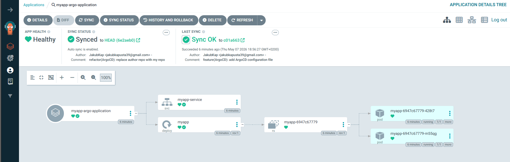

# ArgoCD Tutorial

Based on [YouTube Tutorial](https://www.youtube.com/watch?v=MeU5_k9ssrs) by Nana

## Purpose

ArgoCD continuously monitors the [ArgoCD_tutorial](https://github.com/JakubKap/ArgoCD_tutorial) repository and compares its state with the local cluster. When drift is detected, ArgoCD automatically synchronizes the cluster to match the Git repository.

## Assumptions

- This project assumes ArgoCD runs locally via Minikube
- Automatic cluster updates are performed only in a local environment

## Prerequisites

Install ArgoCD in your cluster:

```bash
kubectl create namespace argocd
kubectl apply -n argocd --server-side --force-conflicts -f https://raw.githubusercontent.com/argoproj/argo-cd/stable/manifests/install.yaml
```

## Accessing ArgoCD UI

1. Verify the argocd-server port (default is 443):

   ```bash
   kubectl get svc -n argocd
   ```

   Expected output:

   ```
   NAME                            TYPE        CLUSTER-IP     PORT(S)                      AGE
   argocd-server                   ClusterIP   10.103.222.7   443/TCP                      2m53s
   ...
   ```

   Note the **PORT(S)** column value for `argocd-server` (typically `443/TCP`).

2. Port forward to access the UI (adjust the port if different):

   ```bash
   kubectl port-forward -n argocd svc/argocd-server 8080:443
   ```

3. Open `http://localhost:8080` in your browser

### Default Credentials

- **Username:** `admin`
- **Password:** Retrieve and decode the initial admin secret:
   ```bash
   kubectl get secret argocd-initial-admin-secret -n argocd -o yaml
   echo <PASSWORD_FROM_YAML> | base64 --decode
   ```

## Deploying an Application

Apply the ArgoCD application configuration:

```bash
kubectl apply -f application.yaml
```

## Dashboard



## Resources

- [ArgoCD Documentation](https://argo-cd.readthedocs.io/)
- [ArgoCD GitHub](https://github.com/argoproj/argo-cd)